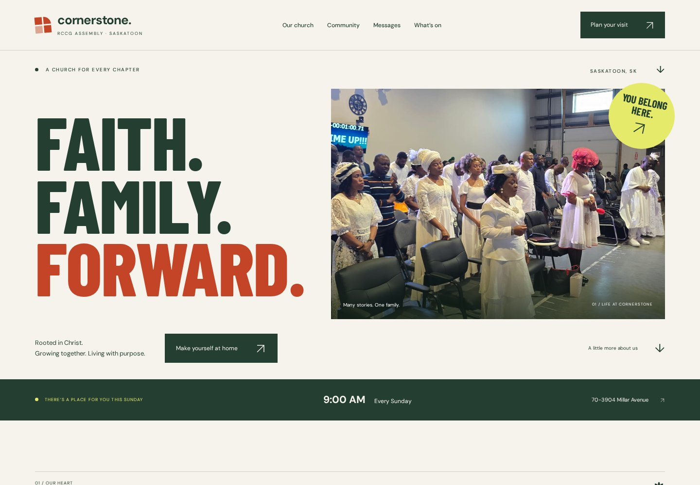
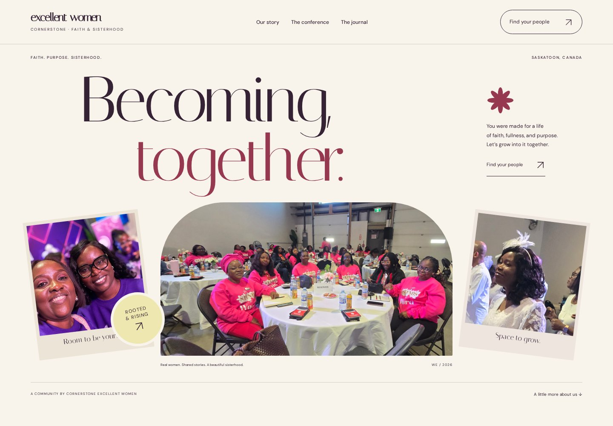

# Two new directions

This redesign uses the references named in [PR #37](https://github.com/nosabecom/churchwebsite/pull/37) and [PR #36](https://github.com/nosabecom/churchwebsite/pull/36) as a starting point for distinct new compositions. Both original references were inspected visually in Chromium: [House of Praise](https://www.houseofpraise.ca/) and [Balance Living](https://balanceliving.org/).

## Cornerstone: Faith. Family. Forward.

Forest green, vermilion, warm paper, and citron. Oversized condensed typography gives the opening a poster-like quality. The cornerstone motif becomes a small architectural graphic system. Real community photographs, generous space, and a clear Sunday invitation keep the experience grounded in people.

[Desktop, full page](church-desktop.jpg) · [Mobile, full page](church-mobile.jpg)

## Excellent Women: Becoming, together.

Aubergine, wine, warm paper, and butter yellow. Expressive serif typography, an asymmetric photo collage, and a journal-like rhythm create a warmer, more personal identity. The conference archive extends this into large year titles, documentary photography, speaker portraits, and galleries.

[Desktop, full page](women-desktop.jpg) · [Mobile, full page](women-mobile.jpg)

## Implementation

- Rebuilt both homepages, navigation, mobile menus, and footers.
- Redesigned the church visitor page, ministry/team directories and details, contact page, and message landing treatment; recolored the working calendar without replacing its filtering and URL state.
- Rebuilt the women's conference archive and 2025/2026 openings, speaker rail, galleries with keyboard-accessible photo viewers, and contact page.
- Extended typography, surfaces, spacing, and palette through the remaining newsletter, message, and conference routes. Long CMS titles wrap inside their columns.
- Kept the existing Sanity newsletter readers, generated types, route contracts, and Breeze form validation. Newsletter screenshots can include development test content; the existing sample message records remain.
- Contact pages explicitly compose an email draft for the visitor to review and send. They do not claim to submit to a backend. The previous unconnected mailing-list controls now lead to the journal and contact routes.
- Fonts are served locally with their OFL licenses. All photography is reused from the repository's existing community/conference assets; no reference-site photographs or brand assets were copied.
- Motion is progressive enhancement: content is visible without JavaScript, with reduced-motion support. Navigation and gallery dialogs use native modal focus containment and Escape behavior.

## Local review

The review session serves the built sites at:

- Church Main: http://127.0.0.1:8761
- Woman Excel: http://127.0.0.1:8762

For subsequent development, use `pnpm dev:churchmain` and `pnpm dev:womanexcel` with the root `.env.development` configured as described in the repository README. If the default Woman Excel port 1234 is occupied, run `pnpm --filter @churchwebsite/womanexcel dev --port 4322`.

T3 preview automation was attempted twice and reported no available automation host. Visual and interaction checks instead used local headless Chromium.

## Verification

- Both website builds and the generated route/internal-link checker: 34 Church Main pages and 12 Woman Excel pages.
- Sanity TypeGen consistency and the repository-wide build.
- Desktop and mobile browser review of both homepages and 16 representative interior routes; no runtime exceptions, broken loaded images, or horizontal page overflow after fixes.
- Homepage responsive checks at 320, 390, 768, 1024, and 1440px.
- Mobile menu open/close, Escape, focus restoration, and desktop breakpoint reset.
- Gallery open, next/previous keyboard navigation, Escape, focus restoration, and scroll-lock release.
- Contact validation and email-draft state; no messages were sent.
- Calendar Month/List switching, empty search, month navigation, and message archive search.
- Reduced-motion checks on both homepages.
- Axe WCAG 2 A/AA and 2.1 AA checks on ten representative mobile pages: zero violations after correcting the gallery caption contrast.

These automated checks supplement visual review; they are not a claim of exhaustive accessibility certification.
